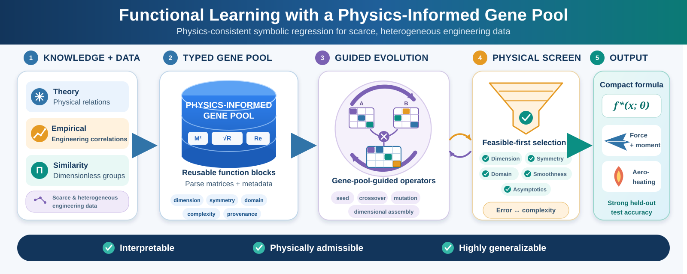

# Functional Learning (FL), a physics-consistent symbolic regression framework centered on a physics-informed gene pool

This repository provides scripts for discovering compact, interpretable governing equations from experimental or simulation data. **Functional Learning (FL)** is the primary method: a symbolic regression framework that constrains the search space through a **physics-informed gene pool**, encouraging expressions that remain consistent with known physical structure while still fitting the data.



Two widely used baselines—**PySR** and **gplearn**—are included for comparison on the same datasets and evaluation metrics.

## Overview

Symbolic regression searches for closed-form formulas that map input variables to a target quantity. Generic genetic-programming approaches often produce expressions that fit well numerically but violate physical intuition (wrong dimensions, non-smooth behavior, or spurious terms).

FL addresses this by seeding and evolving candidates from a **physics-informed gene pool**: a curated set of operators, functional forms, and structural priors derived from domain knowledge. The search remains data-driven, but the candidate space is biased toward **physics-consistent** models—compact formulas that generalize better and are easier to interpret.

| Script | Method | Language |
|--------|--------|----------|
| `FLearning_test.jl` | Functional Learning (FL) | Julia |
| `PySR_test.py` | PySR (high-performance symbolic regression) | Python |
| `gplearn_test.py` | gplearn `SymbolicRegressor` | Python |

## Project Structure

```
.
├── FLearning_test.jl      # FL training and archiving
├── PySR_test.py           # PySR baseline with plots and reports
├── gplearn_test.py        # gplearn baseline with SymPy simplification
├── datasets/              # Excel datasets (place .xlsx files here)
│   ├── AeroHeating_Fused.xlsx
│   ├── Steady_CN_0-90.xlsx
│   ├── Steady_CN_90-180.xlsx
│   ├── Steady_mZ0_0-90.xlsx
│   └── Steady_mZ0_90-180.xlsx
├── Backups/               # Archived results (created at runtime)
├── Report.txt             # Latest model report (FL / PySR)
└── bestFormula.txt        # Best formula from FL (FL only)
```

## Datasets

Data are stored as Excel (`.xlsx`) files under `datasets/`. Each file contains input features in the leading columns and the target variable in the last column.

Example feature naming (aerodynamic / heating cases):

- `sinA`, `sinD`, `SL`, `Re`, `dY`, `CN`

### Train / test split

For the fused aerodynamic-heating dataset (`AeroHeating_Fused.xlsx`, 1850 samples):

- **Training:** 1500 observations
- **Test:** 350 observations

The Python scripts apply this split sequentially (first 1500 rows for training, next 350 for test). The Julia script uses dataset-specific settings configured in `FLearning_test.jl` (see below).

## Functional Learning (`FLearning_test.jl`)

FL runs multiple rounds of symbolic search and writes the best formulas and metrics to disk.

**Key parameters:**

| Parameter | Default | Description |
|-----------|---------|-------------|
| `nround` | 10 | Number of independent search rounds |
| `popsize` | 50 | Population size |
| `maxNodes` | 20 | Maximum expression tree size |
| `maxIter` | 200 | Maximum iterations per round |
| `validation_rate` | 0.2 | Fraction of training data held out for validation |

**Outputs per round:**

- `Report.txt` — training summary and performance metrics
- `bestFormula.txt` — best formula on the Pareto front
- `Backups/<dataset>.<R2>.<timestamp>.7z` — archived data, report, and formula

**Run:**

```bash
julia FLearning_test.jl
```

**Requirements:** Julia packages `XLSX`, `SymbolicUtils`, `Statistics`, and the `FLearning` module compiled in ./bin/FLearning.dll. [7-Zip](https://www.7-zip.org/) must be available on `PATH` for archiving.

## PySR Baseline (`PySR_test.py`)

PySR performs parallel symbolic regression with configurable operator sets and early stopping on loss and complexity.

**Highlights:**

- 10 rounds of training with expression simplification via SymPy
- Metrics: RMSE, relative error, R² (training and test)
- Scatter and index plots saved as PNG
- Results archived under `Backups/`

**Run:**

```bash
python PySR_test.py
```

**Requirements:** `pysr`, `numpy`, `pandas`, `matplotlib`, `openpyxl` (for Excel I/O), and 7-Zip.

## gplearn Baseline (`gplearn_test.py`)

gplearn's genetic-programming symbolic regressor provides a classical GP baseline on the same fused dataset and split.

**Highlights:**

- Fits a single symbolic model with configurable GP hyperparameters
- Reports R², mean relative error (%), and RRMSE on train and test sets
- Simplifies and re-indexes the discovered expression with SymPy (`X0 → X1`, etc.)

**Run:**

```bash
python gplearn_test.py
```

**Requirements:** `gplearn`, `scikit-learn`, `numpy`, `pandas`, `sympy`, `openpyxl`.

## Evaluation Metrics

All scripts report standard regression quality measures:

| Metric | Description |
|--------|-------------|
| **R²** | Coefficient of determination |
| **RMSE** | Root mean square error |
| **Relative error** | Normalized error relative to the target scale |
| **RRMSE** | RMSE divided by max \|y\| (gplearn script) |

Use the **test-set** metrics to compare generalization across FL, PySR, and gplearn.

## Switching Datasets

Comment or uncomment the dataset path near the top of each script:

```python
# Python (PySR / gplearn)
basename = './datasets/AeroHeating_Fused'
# basename = './datasets/Steady_CN_0-90'
```

```julia
# Julia (FL)
baseName = "Steady_CN_0-90"
# NTrain = 65   # for Steady_CN_0-90 and Steady_mZ0_0-90
# NTrain = 35   # for Steady_CN_90-180 and Steady_mZ0_90-180
```

Adjust `NTrain` in `FLearning_test.jl` when changing the Julia dataset.

## Typical Workflow

1. Place or select a dataset under `datasets/`.
2. Set the train/test partition (or `NTrain` for Julia).
3. Run FL, PySR, and/or gplearn.
4. Compare test R², relative error, and formula complexity in `Report.txt` and console output.
5. Inspect archived runs in `Backups/` for reproducibility.

## Notes

- Ensure the `Backups/` directory exists before running, or create it manually.
- PySR may require a separate Julia installation and first-time package precompilation.
- Long runs (many iterations or rounds) are expected; reduce `nround`, `niterations`, or `generations` for quick tests.

## License

MIT License
